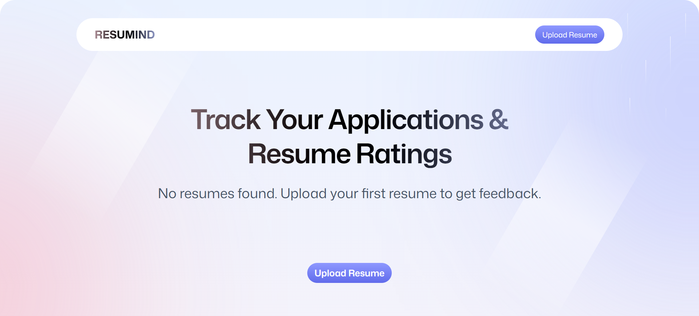
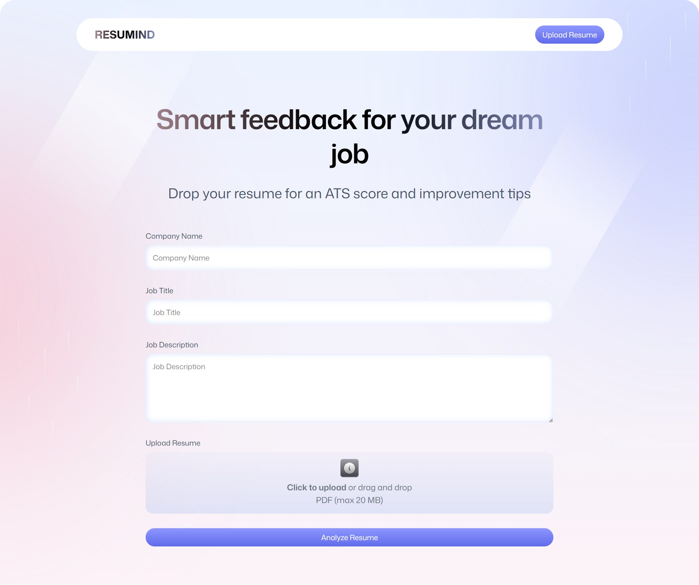
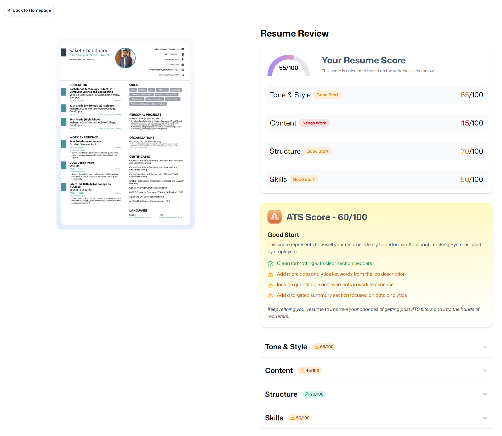

# RESUMIND - AI-Powered Serverless Resume Analyzer

[](https://ai-resume-analyzer-jet-xi.vercel.app/)
[](https://reactjs.org/)
[](https://www.typescriptlang.org/)
[](https://tailwindcss.com/)
[](https://super-magical-website.com)

---

## 🌟 Overview

**RESUMIND** is a serverless, AI-powered resume analyzer and personal job search assistant. It helps users get actionable feedback on their resumes against job descriptions using free AI models, without needing backend infrastructure.  

The platform converts uploaded resumes to images, scores them using AI models, and provides detailed feedback on:

- Resume tone & style  
- Content completeness & structure  
- Skills alignment with job requirements  
- ATS (Applicant Tracking System) score  

RESUMIND is fully serverless, scalable, and built with modern front-end frameworks and cloud-native tools powered by **Puter.js**.

**Live Demo:** [RESUMIND](https://ai-resume-analyzer-jet-xi.vercel.app/)

---

## 🚀 Features

- **Serverless Architecture:** Powered by [Puter.js](https://super-magical-website.com), offering cloud storage, AI, and database functionalities.  
- **AI Resume Analysis:** Uses free AI models like Claude, GPT, and Gemini for detailed ATS feedback.  
- **File Uploads:** Drag-and-drop PDF upload via React Drop Zone.  
- **PDF-to-Image Conversion:** Converts resumes for visual preview in the UI.  
- **Multi-Resume Management:** Handle multiple resumes with organized detail views.  
- **Collapsible Feedback Sections:** Tone, style, structure, and skill analysis in user-friendly accordions.  
- **User Authentication:** Login/logout flows with Puter OAuth integration.  
- **Zero-Cost Deployment:** Fully serverless with optional monetization through Puter’s app ecosystem.  
- **Wipe Data Utility:** Clear all uploaded resumes and feedback with a single click.  

---

## 🛠️ Tech Stack

| Layer              | Technology & Libraries                                           |
|-------------------|-----------------------------------------------------------------|
| Frontend           | ReactJS (v18), React Router v7, TypeScript, Tailwind CSS v4     |
| State Management   | Zustand                                                        |
| File Upload        | React Drop Zone                                                |
| PDF Handling       | PDF-to-Image Conversion Utilities                               |
| AI Integration     | Puter.js AI (Claude, GPT, Gemini)                               |
| Backend/Serverless | Puter.js (Cloud Storage, Database, Auth)                        |
| Deployment         | Vercel                                                         |
| IDE & Tools        | Vite, WebStorm, JetBrains AI Assistant Juny                     |

---

## 🖼️ Screenshots / Pages

### Homepage


### Other Pages
| Resume Upload | Resume Detail |
|---------------|---------------|
|  |  |


---

## ⚡ How It Works

1. **Upload Resume & Job Description:**  
   Drag and drop resume PDFs, fill job title & company. Files are stored on Puter cloud.

2. **AI Feedback Generation:**  
   Resume and job description are analyzed via free AI models. Feedback includes:

   - Tone & style assessment  
   - Content & structure evaluation  
   - Skills matching & gaps  
   - ATS scoring  

3. **Detailed Feedback Display:**  
   Collapsible accordions display resume insights and recommendations. Users can download resumes or view them as images.

4. **Manage Multiple Resumes:**  
   Home page shows all uploaded resumes with status, ATS score, and AI recommendations.

5. **Data Cleanup:**  
   Wipe page clears all uploaded files and feedback data.

---

## 📌 Highlights

- **Serverless with Puter.js:** No backend setup required. All storage, AI, and database operations are handled serverlessly.  
- **Drag-and-Drop PDF Uploads:** Simple, intuitive UI for submitting resumes.  
- **Dynamic Resume Previews:** Convert PDF to images for better visualization.  
- **AI Feedback Across Multiple Dimensions:** Tone, structure, content, skills, and ATS scoring.  
- **Deployment Ready:** Hosted live on Vercel with zero infrastructure cost.  

---

## 🧠 Learning Outcomes / Key Insights

- Building serverless web applications with modern cloud tools.  
- Integrating AI services in a front-end application.  
- Handling PDF files, converting to images, and managing file storage in cloud environments.  
- Implementing responsive UI with Tailwind CSS and React components.  
- State management using Zustand for global auth & app state.  
- Clean architecture for scalability, maintainability, and developer productivity.

---

## 🔗 Links

- **Live Demo:** [RESUMIND](https://ai-resume-analyzer-jet-xi.vercel.app/)  
- **GitHub Repository:** *[AI-resume-analyzer](https://github.com/Saket22-CS/AI-resume-analyzer.git)*  

---

## 📦 Installation / Local Setup (Optional)

```bash
# Clone the repo
git clone https://github.com/yourusername/resumind.git
cd resumind

# Install dependencies
npm install

# Run the development server
npm run dev
```

Open [http://localhost:5173](http://localhost:5173) in your browser.

---

## 👨‍💻 Author

**Saket Chaudhary** – Aspiring Software Engineer & AI Enthusiast

* GitHub: [Saket22-CS](https://github.com/Saket22-CS)  
* LinkedIn: [linkedin.com/in/saket-chaudhary22](https://www.linkedin.com/in/saket-chaudhary22)

---

## 🌐 License

MIT License © 2025 Saket Chaudhary
